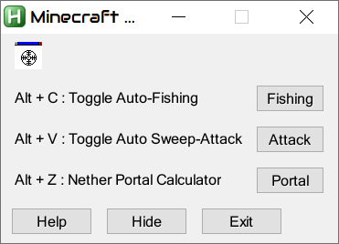

# AHK Minecraft Tools
> A simple AutoHotkey script created for Minecraft.

------------

------------

### Features
- **AFK-Fishing** : Simply find a safe spot to fish, and let the script do the rest. What it differs from other AFK Fishing script is it's efficiency. It will automatically reel-in the rod **only if it caught something** and quickly cast it again. It also gives a report on how many fish/items you acquired and the elapsed time in HH:MM:SS format. (see [Limitations and Known Bugs](#limitations-and-known-bugs) for additional info.)

- **Auto-Sweep Attack** : Running a mob spawning farm that requires you to attack the mobs for exp while AFK? This is the answer for you. (see [Limitations and Known Bugs](#limitations-and-known-bugs) for additional info.)

- **Nether Portal Calculator** : No need to go online for Portal Calculators and typing in your coordinates in order to know your Nether Portal coordinates. This script does all the work in-game. Calculates coordinate in Overworld >> Nether and vice-versa.

------------

### Controls
- **Alt + C** : Toggle Auto-Fishing
- **Alt + V** : Toggle Auto-Sweep Attack
- **Alt + Z** : Nether Portal Calculator
- **Alt + W** : Lock on Targetted Window

------------

### Important Reminders
1. AutoHotkey must be installed before using this script, duh!
2. Caption (subtitle) must be turned ON in Minecraft's setting.
3. Gui scale must be set to 2 in Minecraft's setting.
4. A good item hopper setup is essential for AFK-Fishing.
5. Works for all applicable Minecraft versions up to the latest version.

------------

### Changelog
1. Updated the script to work on any sized window.
2. Attack indicator can be set to any.
3. Added GUI buttons.
4. Added 2 different triggers for selecting/targetting a window. (Drag'n Drop and Alt + W)
   A Window must be selected prior to being able to use the GUI Buttons or Hotkeys.
5. Modified to use GDIP libraries, as such making the script truly AFK. You can swap windows anytime.

------------

### Limitations and Known Bugs
1. Auto-Sweep Attack works as a spammer with a delay of 630 ms. A sword (whether enchanted or non-enchanted or of any material) in vanilla minecraft has a recovery time of 625 ms. Since it doesn't rely on an image search and instead relies on a delay, it will keep working even if there are no mobs in sight. Preferred way to use it on a farm/grinder is something that runs continously. This was changed from image search to specifically curb the earlier limitations of Auto-Sweep Attack only working on dark mobs since the image to be searched was specifically lighter in color, and on light colored surfaces it could potentially keep on spamming repeatedly even when there were no mobs.
2. Windows can't be put in a Virtual Desktop windows and hence needs to be on the same Desktop Window you are working on.

------------

### Credits
Thanks to houdini101 for creating the initial script.

Thanks to [tariqporter] [Rseding91] [mmikeww] & [marius-sucan] for their work on GDIP library.
> Gdip_All.ahk was used to add the GDIP functions to the script.
> https://github.com/marius-sucan/AHK-GDIp-Library-Compilation

Thanks to [MasterFocus] for his wonderful Gdip_Imagesearch counterpart of Imagesearch.
> Gdip_Imagesearch.ahk was used instead of Imagesearch to make it compatible with GDIP.
> https://github.com/MasterFocus/AutoHotkey

Thanks to [just me] for simplifying SKAN's work and created Image2Include.ahk +GUI.
> Image2Include.ahk was used for converting image files to HBitmap. 
> https://www.autohotkey.com/board/topic/93292-image2include-include-images-in-your-scripts/

Thanks to [SKAN] for creating a wonderful script.
> Bitmap creation adopted from "How to convert Image data (JPEG/PNG/GIF) to hBITMAP?" by SKAN
> http://www.autohotkey.com/board/topic/21213-how-to-convert-image-data-jpegpnggif-to-hbitmap/?p=139257

Thanks to various anonymous members who helped me work out the whole GUI buttons and ImageSearch with GDIP.

------------
